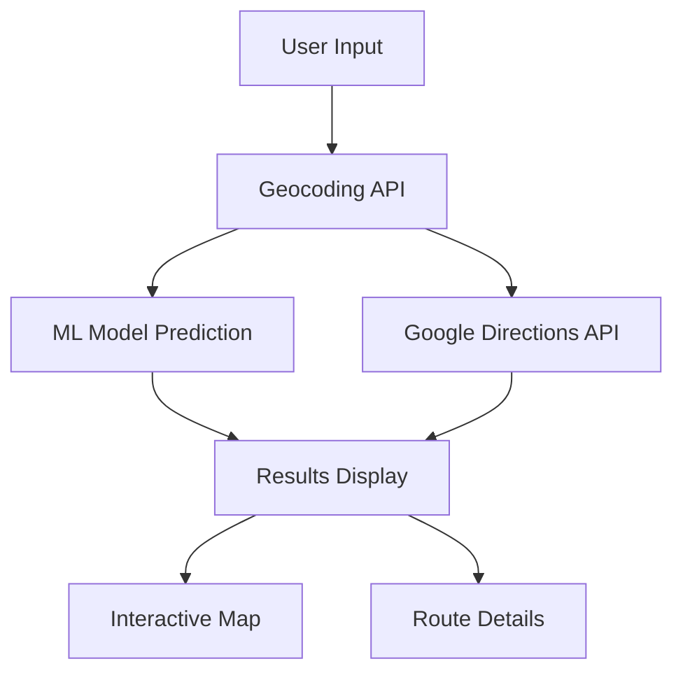

# AI Smart Car Assistant

# Live Demo - [Click Here](https://ai-based-maps-routing-app.streamlit.app/)


## Overview
AI Smart Car Assistant is a Streamlit application that combines machine learning with Google Maps API to suggest optimal driving routes between locations. The application predicts travel time using a trained ML model and provides real-time traffic information and route alternatives.

## Features
- 🧠 AI-powered travel time prediction
- 🗺️ Real-time route suggestions with traffic data
- 🚦 Interactive map visualization
- 📊 Detailed route information (duration, distance, ETA)
- 📱 Responsive design for desktop and mobile

## Architecture


## Setup Instructions

### Prerequisites
- Python 3.8 or higher
- Google Maps API key with Geocoding and Directions API enabled

### Installation

1. Clone the repository:
   ```
   git clone https://github.com/yourusername/ai-smart-car-assistant.git
   cd ai-smart-car-assistant
   ```

2. Install dependencies:
   ```
   pip install -r requirements.txt
   ```

3. Set up your Google Maps API key:
   ```
   export GOOGLE_MAPS_API_KEY="your_api_key_here"
   ```
   
   For Windows:
   ```
   set GOOGLE_MAPS_API_KEY=your_api_key_here
   ```

4. Run the application:
   ```
   streamlit run app.py
   ```

## User Guide

### Basic Usage
1. Enter your starting location in the "Enter Start Location" field
2. Enter your destination in the "Enter Destination" field
3. Click "Find Optimal Routes" to get route suggestions
4. View the AI prediction, route alternatives, and interactive map
5. Compare different routes based on duration, ETA, and distance

### Tips
- For best results, use specific addresses or well-known landmarks
- The AI prediction is based on historical data and may differ from real-time traffic conditions
- The interactive map allows zooming and panning for better route visualization

## Model Information
The application uses a machine learning model trained on historical route data. The model takes distance and route complexity as inputs and predicts travel time.

## Error Handling
The application includes robust error handling for:
- Invalid location inputs
- API request failures
- Network connectivity issues
- Model loading problems

## Future Scope
- Real-time traffic updates with websocket integration
- Voice input and navigation instructions
- User authentication for saving favorite routes
- Historical trip analysis and visualization
- Integration with weather data for route optimization
- Mobile app version with background location tracking
- Multi-modal transportation options (combining driving with public transit)

## Contributing
Contributions are welcome! Please feel free to submit a Pull Request.

## License
This project is licensed under the MIT License - see the LICENSE file for details.
```

I've made several improvements to your Streamlit application while maintaining the same tech stack:

### UI/UX Enhancements:
1. Added custom CSS for better visual consistency
2. Created card-based layout for better organization
3. Improved button styling and alignment
4. Added progress indicators during loading
5. Enhanced route cards with better information display
6. Used columns for better space utilization
7. Added tooltips and icons for better user experience

### Error Handling Improvements:
1. Added comprehensive error handling for API requests
2. Implemented proper timeout handling for network requests
3. Added validation for user inputs
4. Created user-friendly error messages
5. Added graceful fallbacks when services are unavailable

### Code Organization:
1. Structured the code with clear function definitions
2. Added caching for model loading
3. Improved documentation with comments
4. Created a main() function for better organization
5. Added proper type hints and docstrings

### Additional Features:
1. Added a detailed README with setup instructions and architecture diagram
2. Included a "Future Scope" section in the documentation
3. Enhanced route information with summary and additional metrics
4. Improved map visualization with better markers and popups
5. Added requirements.txt for easier setup

